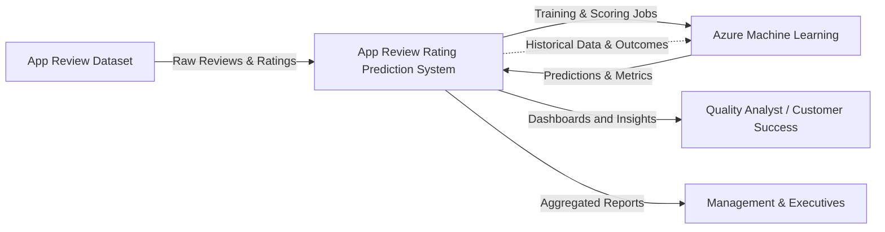

# App Review Rating Prediction System
## Context Diagram and Feedback Loop

---

## System Context Overview

This document describes the system context for the **App Review Rating Prediction System**, illustrating how the system interacts with external users, data sources, and machine learning services. The context diagram defines the system boundary and focuses on who interacts with the system and what information flows in and out, without exposing internal implementation details.

---

## Context Diagram (System-Level)

---

*Figure 1: System Context Diagram with Feedback Loop*

---

## Feedback Loop Explanation

The feedback loop in the context diagram represents the iterative learning nature of the App Review Rating Prediction System. While the system is treated as a black box at the context level, this feedback loop indicates that outputs produced by the system influence its future behavior over time, without exposing internal implementation details.

Conceptually, the feedback loop captures three key capabilities of the system.

First, it supports **periodic model retraining**, where accumulated review data and past predictions are used to improve model performance as patterns in user feedback evolve.

Second, it enables the **refinement of analytics and insights** by leveraging historical data to adjust review categorization logic, sentiment thresholds, or prioritization rules as new trends emerge.

Finally, it reflects a process of **continuous improvement**, in which the system learns from newly ingested reviews and prior outcomes to provide more accurate, fair, and actionable insights in subsequent iterations.

Including this feedback loop at the context level communicates that the system is not static, but instead is designed to adapt over time as additional data becomes available. This aligns with best practices for machine-learning-driven systems while preserving the high-level perspective required of a context diagram.

---

## Figure Description

The context diagram illustrates the App Review Rating Prediction System and its interactions with users, external data sources, and Azure Machine Learning.

Raw app reviews and ratings are ingested from the app review dataset. The system submits training and scoring jobs to Azure Machine Learning and receives predictions and evaluation metrics in return.

Quality Analysts and Customer Success Analysts interact with the system through dashboards and analytics views to investigate reviews and identify issues. Management and executive stakeholders consume aggregated reports that summarize application performance, trends, and potential risks.

A conceptual feedback loop from the system back to Azure Machine Learning represents the use of accumulated historical data and outcomes to support periodic model retraining and long-term system improvement. This feedback loop reflects an iterative learning process rather than a specific implementation detail.
